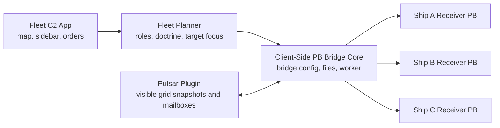

# Fleet C2 Design

**Status:** Accepted for planning
**Author:** Codex with operator input
**Last updated:** 2026-08-21
**Related:** `planning/architecture.md`, `planning/multi_adapter_bridge_orchestrator.md`, `contracts/bridge_contract.md`

## Problem

The target server disables AI blocks and enforces a strict global programmable
block runtime cap of about 0.3 ms per player. The operator wants RTS-like
control over a small squad of unique combat grids, usually one or two frigates
plus escort corvettes, without moving heavy planning work into server-side PBs.

The existing Client-Side PB Bridge already provides a useful foundation:
pasteable PB shims, local Pulsar mailbox mirroring, plugin-side snapshots,
Docker-side planning, allowlisted command application, and per-bridge command
queues. Fleet C2 should use that infrastructure as a private module rather than
expanding the broadly shared bridge manager with tactical fleet-control UI.

## Goals

- Control a visible, tethered squad of about three to five ships.
- Keep fleet planning client-side and PB-side work limited to tiny receiver
  actuation.
- Use vanilla functionality wherever possible, especially Remote Control
  autopilot and ship block systems.
- Support role-first doctrine for rail frigates and escort corvettes.
- Provide a dedicated standalone Fleet C2 app with a lead-centered abstract 3D
  tactical map and a high-level ship status sidebar.
- Preserve explicit operator authority and fail closed when a ship cannot be
  safely controlled.

## Non-Goals

- Do not build a remote-control system that works outside render range in V1.
- Do not add an in-game squad leader PB that spends server PB budget
  coordinating the fleet.
- Do not implement a heavy real-time positional map if it requires PB-side grid
  scanning.
- Do not add generic terminal-property writes or arbitrary WeaponCore control.
- Do not require every ship to have redundant PBs.

## Proposed Solution

Build a private standalone Fleet C2 desktop app that uses Client-Side PB Bridge
as the transport/runtime layer. Fleet C2 owns squads, roles, orders, target
focus, receiver failover, discovery readiness, and the tactical UI. It fans
small per-ship command packets directly to each ship bridge.

Each ship has one active C2 receiver PB. A ship may also have an optional
standby receiver PB for redundancy. Only one receiver may actuate at a time.
Fleet-level coordination lives in the app, not in a server-side PB.

The operator remains in the cockpit of the lead ship to keep the squad within
the current client-side bridge limits. The lead ship is the map origin and
tether, but Fleet C2 may pilot it while autonomous mode is enabled. Running the
receiver PB with `c2 on`, `c2 off`, or `c2 toggle` changes that ship's local
authority. Turning C2 off makes the ship observe-only; it does not automatically
change other squad members' orders.

### Component Model

## Registration And Discovery

Fleet C2 registration is app-led:

1. Create ship bridges in the Fleet C2 app.
2. Assign each bridge to the `fleet_c2` module and a stable ship role/class.
3. Generate the per-ship shim and CustomData.
4. Paste or load the shim/CustomData onto the ship PB in game.
5. Run discovery while the ships are visible to the client.
6. Review blockers, warnings, advisories, and exact fix actions.

The ship's class/core block is the authoritative datum for class, orientation,
ship-frame assumptions, and server class-limit expectations. Discovery should
use it to infer or validate whether the ship is a rail frigate or escort
corvette. Orientation for rails and main drives should be derived from the core
block rather than guessed from individual weapon blocks when possible.

### Readiness Levels

Hard blockers prevent C2 eligibility:

- no primary receiver heartbeat
- bridge id mismatch
- missing or invalid class/core block
- no usable Remote Control block
- insufficient movement actuators for vanilla autopilot/corrections
- stale or missing ship snapshot
- autonomous mode off for that ship

Warnings allow "do its best" operation:

- backup receiver absent
- backup receiver unhealthy while the primary is healthy
- WeaponCore lock or `No Pwr` telemetry not proven
- PDC or rail group readiness degraded
- target ranking unavailable
- telemetry quality stale but not absent

Advisories are informational and do not affect eligibility.

## Roles

Fleet C2 is role-first. Roles are stable ship identities; orders change over
time and are interpreted through each role's doctrine.

### Rail Frigate

- Primary job: fixed-rail standoff damage.
- Preferred band: 8-8.5 km, inside the 10 km rail maximum.
- Avoid: hostile PDC range below 3 km.
- Geometry: maintain a side-angle rail solution using the core-frame
  orientation.
- Targeting: WeaponCore power targeting is a default ship-prep setting.
- Target cycling: retire a target when it reports `No Pwr` or is otherwise
  marked disabled.

### Escort Corvette

- Primary job: PDC close-in defense and torpedo interception.
- Secondary job: single-rail contribution at fleet standoff range.
- Preferred position: screen or offset around protected frigates or the lead
  ship.
- Geometry: keep general range and orientation toward the enemy grid while
  preserving screen position.
- Avoid: overextending into hostile PDC range or chasing away from the protected
  ships.
- Fallback: regroup if screen geometry or contact data becomes stale.

## Orders

V1 exposes six basic orders:

- `Patrol`: move between points and maintain doctrine.
- `Guard`: protect a ship or area and maintain role-specific screen geometry.
- `Pursue`: close or maintain the rail envelope on the selected target.
- `Hold Formation`: keep assigned offsets and facing.
- `Regroup`: recover toward the anchor or lead ship safely.
- `Disengage`: burn away along the current movement vector, then reduce
  signature once contact is broken or the squad is beyond the sensor-risk band.

Disengagement uses max burn until greater than 200 km from enemy contact, then
transitions to reduced-signature thrust because main-drive burn may be visible
to server sensor mods at roughly 200-300 km.

## Movement Control

V1 uses a hybrid movement model:

- The client planner computes tactical intent and role-specific desired
  geometry.
- Remote Control blocks and vanilla autopilot perform the heavy movement work.
- Receiver PBs apply tiny command packets for waypoint/autopilot updates,
  autonomous-mode authority, and narrow tactical corrections that vanilla
  blocks do not cover.

This is preferred over direct thruster/gyro control because the 0.3 ms global
PB cap makes continuous hand-rolled flight control risky. Direct thrust/gyro
control remains a future fallback only if Remote Control behavior proves
insufficient.

## Targeting

V1 target priority is:

1. Use the in-game WeaponCore lock-on target if the bridge can surface it.
2. Use manual Fleet C2 target selection if WeaponCore lock telemetry is not
   available.
3. Keep focus until WeaponCore or other telemetry reports `No Pwr`.
4. Retire disabled targets so their remains can be salvaged later.
5. Fall back to the nearest powered hostile if contact data supports it.

WeaponCore power targeting is not a dynamic combat stance in V1. It is the
default ship preparation setting for relevant weapon blocks. If a ship stops
firing because the target has no power, Fleet C2 should cycle fire rather than
continue destroying the disabled hull.

The early proof spike is whether the local plugin can cheaply and reliably
surface WeaponCore lock-on target identity and `No Pwr`/disabled status. Until
that is proven, the app must support manual target selection and manual
`mark disabled`.

## UI

The standalone Fleet C2 app should use a map-dominant primary screen with a
persistent high-level ship status sidebar.

The V1 map is lead-centered and abstract 3D rather than a heavy real-time
coordinate map. It shows tactical relationships and confidence:

- range bands: 3 km danger, 8-8.5 km ideal, 10 km rail max, 200 km disengage
- bearing relative to the lead ship or squad frame
- elevation bands such as above, level, and below
- formation slots for rail line, screen positions, and anchor
- target focus from WeaponCore lock or manual selection
- telemetry confidence such as exact, estimated, or stale

The sidebar stays high level and shows each ship's role, current order,
readiness, authority state, receiver channel, failover state, and warnings.
Detailed diagnostics live behind a drill-in panel so the tactical map remains
the working surface.

## Receiver Authority And Failover

Each receiver supports local authority arguments:

- `c2 on`
- `c2 off`
- `c2 toggle`

When autonomous mode is off, the ship rejects movement and fire-posture command
application but may continue to publish telemetry. Manual takeover affects only
that ship. Other ships keep their current order until the operator issues a new
C2 order.

Optional backup receivers are supported per ship:

- one active receiver at a time
- backup receiver starts passive
- failover is enabled by default when a healthy backup exists
- one missed heartbeat does not trigger failover
- Fleet C2 probes the primary before promoting backup
- if the primary later proves healthy, Fleet C2 demotes backup and restores the
  primary channel
- primary and backup must never actuate simultaneously

Backup receiver absence is advisory only. A ship with a healthy primary remains
C2 eligible without redundancy.

## Bridge And Command Extensions

Fleet C2 should extend the bridge through named module hooks and narrow command
primitives:

- `fleet_c2` bridge/module assignment
- per-ship metadata for role, class/core identity, primary receiver id, backup
  receiver id, and authority state
- discovery fields for class/core block, Remote Control, rails, PDCs, receiver
  heartbeat, and WeaponCore lock/`No Pwr` telemetry if accessible
- receiver commands for Remote Control waypoint/autopilot behavior and authority
  release
- optional narrow WeaponCore setup command only if needed, such as setting
  target-subsystems and subsystem target to power

Do not introduce a generic terminal-property writer. Any new actuator must be a
named, reviewed, same-construct-guarded command kind with clear skip reasons.

## Alternatives Considered

| Option | Pros | Cons | Decision |
| --- | --- | --- | --- |
| Standalone Fleet C2 app with direct fanout | Lowest PB cost, private tactical UI, clean module boundary | Requires module hooks in the bridge framework | Chosen for V1 |
| Lead-ship coordinator PB | Elegant in-game squad anchor | Spends scarce global PB budget on coordination | Rejected for V1 |
| Receiver PB on every ship plus in-game relay network | Could support remote squads later | Fights render-range bridge limitation and adds PB/IGC cost | Future research |
| Full real-time positional map | Best RTS feel | Likely too heavy if PB-side telemetry is needed | Rejected for V1 |
| Direct thruster/gyro flight control | Independent of vanilla autopilot | Higher PB cost and stability risk | Future fallback |

## Risks And Mitigations

| Risk | Impact | Mitigation |
| --- | --- | --- |
| WeaponCore lock or `No Pwr` telemetry is not accessible | Automatic target cycling is degraded | Keep manual target selection and manual mark-disabled in V1 |
| Remote Control autopilot is insufficient for combat geometry | Movement quality is degraded | Start with hybrid waypoint control, then consider narrow corrective primitives |
| Global PB cap is exceeded during multi-ship actuation | Server may throttle or disable PBs | Stagger ship command application, keep receiver loops tiny, and verify runtime early |
| Primary and backup receivers both actuate | Conflicting control commands | Enforce active-channel state and backup passive mode |
| The abstract map misleads the operator | Poor tactical decisions | Show telemetry confidence and avoid claiming exact position when only inferred |
| Tether leaves render range | Bridge traffic stops | V1 explicitly requires commander-in-theater operation |

## Verification Plan

Early verification should happen without live combat:

1. File-backed tests for bridge registration and C2 module assignment.
2. Discovery summary tests for blockers, warnings, advisories, and fix actions.
3. Role/order planner tests for rail frigate and escort corvette behavior.
4. Command fanout tests that prove the app writes only per-ship compact commands.
5. Receiver authority tests for `c2 on`, `c2 off`, and `c2 toggle`.
6. Failover tests for primary stale detection, backup promotion, and primary
   restore.
7. PB shim source tests for any new allowlisted command kinds and skip reasons.
8. Live two-ship smoke test in render range before scaling to a full squad.
9. WeaponCore telemetry spike to prove lock-on and `No Pwr` availability.

## Open Questions

| Question | Resolution Path |
| --- | --- |
| Can the local plugin access WeaponCore lock-on target and `No Pwr` state? | Run a targeted in-game/plugin telemetry spike |
| Which Remote Control APIs are reliable on this server for repeated waypoint updates? | Prototype a single receiver and measure PB runtime |
| What exact class/core block subtype names identify frigates and corvettes? | Capture active server mod definitions during discovery implementation |
| What minimum command packet is needed for rail standoff geometry? | Start with waypoint/autopilot intents and add only proven missing primitives |
| Should Fleet C2 share a common module API with future private modules? | Define the smallest module registry needed for `fleet_c2` first |

